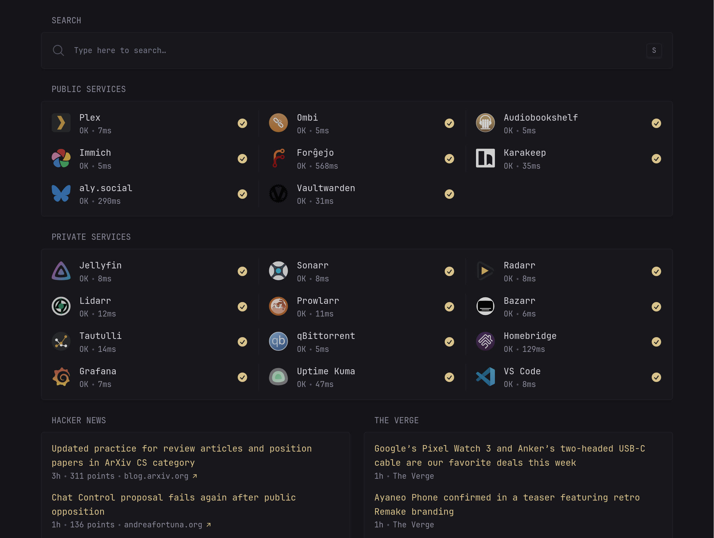

# ❄️ cute.haus

Welcome to **cute.haus**!

This repository contains NixOS and home-manager configurations, along with whatever custom modules and packages required for [cute.haus](https://cute.haus), my personal homelab and computing environment.

---



---

## 📂 Repository Structure

```plaintext
.
├── flake.nix                # Main entry point
├── homes/                   # home-manager configurations
├── hosts/                   # NixOS host configurations
├── modules/                 # Modular configurations
│   ├── home/                # home-manager modules
│   ├── flake/               # Organized flake components
│   │   ├── home-manager.nix # Home-manager configurations
│   │   ├── nixos.nix        # NixOS-specific configurations
│   │   └── ...              # Other flake components
│   ├── nixos/               # NixOS-specific modules
│   └── snippets/            # Reusable configuration snippets
└── overlays/                # Custom Nixpkgs overlays
```

---

## 🤝 Contributing

While this is a personal project, I’m open to feedback or suggestions.\
Feel free to open an issue or share ideas that could improve this setup!

---

## 📜 License

This repository is licensed under the **[GNU General Public License](LICENSE.md)**.

---

## 🙌 Acknowledgments

- [nixcfg](https://github.com/alyraffauf/nixcfg): my original flake from which this repository is derived.
- [nixpkgs](https://github.com/nixos/nixpkgs): 'nough said.
- [agenix](https://github.com/ryantm/agenix): secrets storage and orchestration.
- [disko](https://github.com/nix-community/disko): declarative partitions and disk configuration.
- [home-manager](https://github.com/nix-community/home-manager): declarative dotfile and user package management.
- [lanzaboote](https://github.com/nix-community/lanzaboote): secure boot for NixOS.

---

## ⭐ Stargazers Over Time

[](https://starchart.cc/alyraffauf/cute.haus)

---
